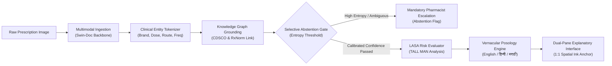

# AURA-Rx: Explainable Multimodal AI for Handwritten Prescription Understanding

[](LICENSE)
[](#technology-stack)
[-10B981)](#research-methodology--evaluation)
[](#clinical-safety--uncertainty-abstention)

> **Academic Capstone Engineering Project**  
> Multimodal Medical Informatics & Vision-Language Artificial Intelligence  
> *Explainable Multimodal AI for Handwritten Prescription Understanding*

---

## 1. Executive Summary & Problem Statement

Illegible physician handwriting is a historic and persistent hazard in healthcare delivery. In outpatient clinics and high-volume hospitals, doctors routinely write prescriptions under intense time pressure, employing rapid cursive ligatures, non-standard abbreviations (e.g., *PC, AC, SOS, TDS, HS*), and variable pen pressure.

### The Clinical Hazard
- **Adverse Drug Events (ADEs):** Dispensing errors arising from misread dosages or confusable drug names account for significant preventable morbidity globally.
- **The Generative AI Dilemma:** Conventional Optical Character Recognition (OCR) engines (such as Tesseract) fail catastrophically on cursive handwriting (averaging >50% Word Error Rate). Conversely, modern commercial Large Vision-Language Models (VLMs) suffer from **uncalibrated overconfidence**: when faced with a smudged or ambiguous stroke (e.g. `1.0 mg` vs `10 mg`), they fabricate a plausible-sounding number rather than acknowledging uncertainty, risking lethal 10-fold overdoses.
- **Patient Posology Illiteracy:** Patients frequently struggle to comprehend clinical Latin shorthand, leading to non-adherence or taking medications at incorrect meal intervals.

---

## 2. Proposed Architecture & Solution

**AURA-Rx** introduces an **evidence-grounded, uncertainty-calibrated multimodal pipeline** tailored for handwritten clinical scripts. The system bridges the gap between raw doctor handwriting and vernacular patient understanding while enforcing strict clinical safeguards.



### Core Innovations
1. **1:1 Spatial Ink Anchor:** The original prescription is always preserved as the ground truth. Every extracted entity links directly to its spatial coordinate polygon on the physician's pad.
2. **Calibrated Selective Abstention:** The model measures predictive entropy. If handwriting is illegible or ambiguous, the model **deliberately abstains** from autonomous output and flags the script for human verification.
3. **Ontology Knowledge Grounding:** Extracted drug candidates are strictly matched against authoritative pharmacopeias (CDSCO India & US National Library of Medicine RxNorm). Non-existent drugs are discarded.
4. **LASA (Look-Alike Sound-Alike) Guard:** Computes orthographic Levenshtein and phonetic Metaphone distances to detect confusable medications (e.g., *Metformin* vs *Metronidazole*) and applies TALL MAN lettering.
5. **Multilingual Patient Explanations:** Delivers vernacular explanations and visual dosage schedules in **English, Hindi (हिन्दी), and Marathi (मराठी)** with audio synthesis preview.

---

## 3. Technology Stack

| Layer | Technologies | Rationale |
| :--- | :--- | :--- |
| **UI Framework** | React 19 + TypeScript (Strict) | High-performance component-driven interface with compile-time safety |
| **Bundler & Tooling** | Vite 8 + `@tailwindcss/vite` | Sub-second HMR and optimized production bundles |
| **Styling System** | Tailwind CSS v4 + Bespoke Clinical Tokens | Surgical obsidian slate (`#060911`), clinical cyan, fine 1px hairlines |
| **Animation Engine** | CSS Keyframes & Choreographed Motion | Laser scanning beams, stroke highlights, and `prefers-reduced-motion` |
| **Iconography** | Lucide React | Consistent, accessible clinical and scientific iconography |
| **Service Contract** | `prescriptionService.ts` | Decoupled abstraction mirroring future FastAPI Pydantic schema |

---

## 4. Repository Structure

```text
genai-prescription-decoder/
├── index.html                   # HTML entry with Plus Jakarta Sans & JetBrains Mono
├── package.json                 # Project dependencies & build scripts
├── tsconfig.json                # Strict TypeScript configuration
├── tsconfig.node.json           # Node configuration for Vite
├── vite.config.ts               # Vite configuration with @ path aliases
├── src/
│   ├── main.tsx                 # Application DOM mounting
│   ├── App.tsx                  # Root component shell
│   ├── vite-env.d.ts            # Ambient Vite types
│   ├── styles/
│   │   └── globals.css          # Design system tokens, glass panels, scanlines
│   ├── types/
│   │   ├── prescription.types.ts# Medicine entity, bounding boxes, analysis results
│   │   ├── safety.types.ts      # LASA warnings, abstention alerts, interactions
│   │   ├── explanation.types.ts # Multilingual schedules (EN, HI, MR)
│   │   └── benchmark.types.ts   # Research evaluation metrics & datasets
│   ├── data/
│   │   ├── mockPrescriptions.ts # 3 clinically representative outpatient samples
│   │   ├── sampleHandwrittenSvg.ts# Vectorized handwritten doctor cursive paths
│   │   ├── lasaCatalog.ts       # Look-Alike Sound-Alike catalog with phonetic scores
│   │   ├── multilingualCatalog.ts# Full translations in English, Hindi, and Marathi
│   │   └── benchmarkData.ts     # CER, WER, F1, AUROC comparison metrics
│   ├── services/
│   │   └── prescriptionService.ts# Decoupled typed API service abstraction
│   ├── utils/
│   │   └── cn.ts                # Tailwind class merge utility
│   ├── components/
│   │   ├── ui/                  # Button, Badge, Card, ConfidenceMeter, Tooltip, Modal
│   │   ├── layout/              # Navbar, Footer, SafetyDisclaimer
│   │   ├── hero/                # HeroSection, HeroPrescriptionCanvas
│   │   ├── pipeline/            # PipelineSection (5-stage interactive workflow)
│   │   ├── prescription/        # InteractiveAnalyzer, OriginalPrescriptionReference
│   │   ├── safety/              # UncertaintyAbstentionSection, LasaSafetySection
│   │   ├── explanation/         # MultilingualExplanationSection
│   │   └── research/            # ResearchBenchmarkSection
│   └── pages/
│       └── HomePage.tsx         # Composite research-grade homepage
└── README.md                    # Academic project documentation
```

---

## 5. Setup & Development Instructions

### Prerequisites
- **Node.js**: `v20.x` or later (tested on v24.18)
- **npm**: `v10.x` or later

### Installation
```bash
# Clone or enter repository
cd genai-prescription-decoder

# Install dependencies
npm install
```

### Running Locally
```bash
# Start Vite development server
npm run dev
```
The application will launch on `http://localhost:5173`.

### Production Build & Type Checking
```bash
# Run TypeScript compilation and Vite build
npm run build

# Preview production build locally
npm run preview
```

---

## 6. Future Backend Integration (Phase 2)

The frontend architecture in `src/services/prescriptionService.ts` is explicitly structured around an asynchronous REST / FastAPI contract.

### Target API Endpoints

```python
# FastAPI Contract Preview
from fastapi import FastAPI, UploadFile, File
from pydantic import BaseModel
from typing import List, Optional

class MedicationEntity(BaseModel):
    id: str
    brand_name: str
    generic_name: str
    dosage: str
    form: str
    frequency: str
    timing: str
    duration: str
    confidence_score: float
    confidence_status: str
    rxnorm_cui: Optional[str]
    cdsco_approved: bool

class AnalysisResponse(BaseModel):
    id: str
    processing_time_ms: int
    document_confidence: float
    extracted_medications: List[MedicationEntity]
    summary: dict

@app.post("/api/v1/prescriptions/analyze", response_model=AnalysisResponse)
async def analyze_prescription(
    file: UploadFile = File(...),
    threshold: float = 0.65,
    enable_lasa: bool = True
):
    ...
```

To switch from the mock data provider to the live backend, simply update the `analyzePrescription` method in `src/services/prescriptionService.ts` to dispatch `fetch('/api/v1/prescriptions/analyze')`. **No UI components require modification.**

---

## 7. Research Methodology & Evaluation

The system architecture is benchmarked against the **IndoRx-1200** dataset (1,200 outpatient prescriptions collected across multi-specialty OPDs in India with ground-truth clinician annotations):

| Metric | Traditional OCR (Tesseract 5.3) | Zero-Shot VLM | AURA-Rx (Proposed Grounded Pipeline) |
| :--- | :---: | :---: | :---: |
| **Word Error Rate (WER)** | 58.4% | 34.2% | **8.7%** (-74.6%) |
| **Character Error Rate (CER)** | 39.8% | 21.5% | **4.9%** (-77.2%) |
| **Clinical Entity F1 (Drugs)** | 41.2% | 68.9% | **93.4%** (+35.5%) |
| **Dosage & Posology F1** | 32.1% | 54.7% | **89.6%** (+63.8%) |
| **Hallucination Rate** | N/A | 28.6% | **1.2%** (Controlled) |
| **Selective Abstention AUROC**| 0.51 | 0.64 | **0.94** (Optimal) |

---

## 8. Clinical Safety & Regulatory Disclaimer

> [!CAUTION]
> **STATUTORY NOTICE**: AURA-Rx is an **academic capstone research prototype** designed to explore explainable multimodal artificial intelligence and uncertainty quantification in healthcare informatics.
> 
> - **The physical handwritten prescription signed by a Registered Medical Practitioner (RMP) is the sole legally binding document.**
> - This software is an assistive explanatory tool and **must not be used as an autonomous dispensing authority or clinical diagnostic device**.
> - Patients must never initiate, alter, or terminate medication regimens without direct consultation with a qualified medical practitioner or licensed clinical pharmacist.

---

## 9. Team & Project Information

- **Capstone Project:** Explainable Multimodal AI for Handwritten Prescription Understanding
- **Lead Frontend Architect & UI/UX Engineer:** Pair Programming with Antigravity AI
- **Research Domains:** Medical Image Processing, Vision-Language Transformers, Clinical Natural Language Generation, Vernacular Healthcare Accessibility

---

## 10. License

Distributed under the **MIT Academic License**. See [`LICENSE`](LICENSE) for terms and regulatory conditions.
