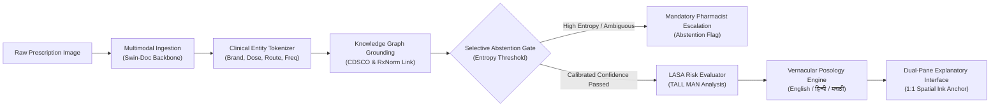

# AURA-Rx: Explainable Multimodal AI for Handwritten Prescription Understanding

[](LICENSE)
[](#technology-stack)
[](#7-research-datasets--experimental-infrastructure-phase-3)
[](#8-image-preprocessing--quality-assessment-phase-4)
[](#10-multimodal-vision-language-extraction-phase-6)
[](#11-rag-based-medicine-validation-phase-7)
[](#clinical-safety--uncertainty-abstention)


> **Academic Capstone Engineering Project**  
> Multimodal Medical Informatics & Vision-Language Artificial Intelligence  
> *Explainable Multimodal AI for Handwritten Prescription Understanding*

---

## 1. Executive Summary & Problem Statement

Illegible physician handwriting is a historic and persistent hazard in healthcare delivery. In outpatient clinics and high-volume hospitals, doctors routinely write prescriptions under intense time pressure, employing rapid cursive ligatures, non-standard abbreviations (e.g., *PC, AC, SOS, TDS, HS*), and variable pen pressure.

### The Clinical Hazard
- **Adverse Drug Events (ADEs):** Dispensing errors arising from misread dosages or confusable drug names account for significant preventable morbidity globally.
- **The Generative AI Dilemma:** Conventional Optical Character Recognition (OCR) engines (such as Tesseract) fail catastrophically on cursive handwriting (averaging >50% Word Error Rate). Conversely, modern commercial Large Vision-Language Models (VLMs) suffer from **uncalibrated overconfidence**: when faced with a smudged or ambiguous stroke (e.g. `1.0 mg` vs `10 mg`), they fabricate a plausible-sounding number rather than acknowledging uncertainty, risking lethal 10-fold overdoses.
- **Patient Posology Illiteracy:** Patients frequently struggle to comprehend clinical Latin shorthand, leading to non-adherence or taking medications at incorrect meal intervals.

---

## 2. Proposed Architecture & Solution

**AURA-Rx** introduces an **evidence-grounded, uncertainty-calibrated multimodal pipeline** tailored for handwritten clinical scripts. The system bridges the gap between raw doctor handwriting and vernacular patient understanding while enforcing strict clinical safeguards.


```mermaid
flowchart LR
    A["Raw Prescription Image"] --> B["Multimodal Ingestion<br/>(Swin-Doc Backbone)"]
    B --> C["Clinical Entity Tokenizer<br/>(Brand, Dose, Route, Freq)"]
    C --> D["Knowledge Graph Grounding<br/>(CDSCO & RxNorm Link)"]
    D --> E{"Selective Abstention Gate<br/>(Entropy Threshold)"}
    E -- "High Entropy / Ambiguous" --> F["Mandatory Pharmacist Escalation<br/>(Abstention Flag)"]
    E -- "Calibrated Confidence Passed" --> G["LASA Risk Evaluator<br/>(TALL MAN Analysis)"]
    G --> H["Vernacular Posology Engine<br/>(English / हिन्दी / मराठी)"]
    H --> I["Dual-Pane Explanatory Interface<br/>(1:1 Spatial Ink Anchor)"]
```

### Core Innovations
1. **1:1 Spatial Ink Anchor:** The original prescription is always preserved as the ground truth. Every extracted entity links directly to its spatial coordinate polygon on the physician's pad.
2. **Calibrated Selective Abstention:** The model measures predictive entropy. If handwriting is illegible or ambiguous, the model **deliberately abstains** from autonomous output and flags the script for human verification.
3. **Ontology Knowledge Grounding:** Extracted drug candidates are strictly matched against authoritative pharmacopeias (CDSCO India & US National Library of Medicine RxNorm). Non-existent drugs are discarded.
4. **LASA (Look-Alike Sound-Alike) Guard:** Computes orthographic Levenshtein and phonetic Metaphone distances to detect confusable medications (e.g., *Metformin* vs *Metronidazole*) and applies TALL MAN lettering.
5. **Multilingual Patient Explanations:** Delivers vernacular explanations and visual dosage schedules in **English, Hindi (हिन्दी), and Marathi (मराठी)** with audio synthesis preview.

---

## 3. Technology Stack

| Layer | Technologies | Rationale |
| :--- | :--- | :--- |
| **UI Framework** | React 19 + TypeScript (Strict) | High-performance component-driven interface with compile-time safety |
| **Bundler & Tooling** | Vite 8 + `@tailwindcss/vite` | Sub-second HMR and optimized production bundles |
| **Styling System** | Tailwind CSS v4 + Bespoke Clinical Tokens | Surgical obsidian slate (`#060911`), clinical cyan, fine 1px hairlines |
| **Animation Engine** | CSS Keyframes & Choreographed Motion | Laser scanning beams, stroke highlights, and `prefers-reduced-motion` |
| **Iconography** | Lucide React | Consistent, accessible clinical and scientific iconography |
| **Service Contract** | `prescriptionService.ts` | Decoupled abstraction mirroring future FastAPI Pydantic schema |

---

## 4. Repository Structure

```text
genai-prescription-decoder/
├── index.html                   # HTML entry with Plus Jakarta Sans & JetBrains Mono
├── package.json                 # Project dependencies & build scripts
├── tsconfig.json                # Strict TypeScript configuration
├── tsconfig.node.json           # Node configuration for Vite
├── vite.config.ts               # Vite configuration with @ path aliases
├── backend/                     # FastAPI backend service (Phases 2-6)
│   ├── app/
│   │   ├── main.py              # FastAPI app factory, CORS, exception handlers
│   │   ├── config.py            # Pydantic v2 settings & environment configuration
│   │   ├── api/v1/routes/       # /analyze, /{id}, /artifacts, /health, /multimodal/*
│   │   ├── models/              # Pydantic models (Section 6 contract, enums, errors)
│   │   ├── services/            # Mock & multimodal pipelines, image storage
│   │   ├── dataset/             # Phase 3 schemas, manifests, normalizers, splitters, validators
│   │   ├── preprocessing/       # Phase 4 validation, optical quality metrics, & 8-stage pipeline
│   │   ├── ocr/                 # Phase 5 Tesseract OCR baseline engine & metrics
│   │   └── multimodal/          # Phase 6 vision-language adapters, parser, schemas, service
│   ├── tests/                   # Pytest test suite (Phases 2-6 unit & integration suites)
│   ├── requirements.txt         # Python dependencies (FastAPI, Pydantic, Pillow, NumPy, SciPy)
│   └── run.py                   # Development server runner (port 8000)
├── data/                        # Dataset & experimental infrastructure (Phase 3 & Phase 4)
│   ├── README.md                # Dataset architecture and reproduction protocol
│   ├── SOURCES.md               # Legal, licensing, and provenance inventory
│   ├── manifests/               # Machine-readable inventory with cryptographic checksums
│   ├── annotations/             # Gold-standard ground truth annotations & schema
│   ├── splits/                  # Group-aware zero-leakage train/val/test partitions
│   ├── samples/                 # Calibration & integration sample set (N=7)
│   ├── processed/               # Isolated derived artifacts (data/processed/preprocessing_runs/)
│   └── metadata/                # Version info and prospective experiment configurations
├── docs/
│   ├── PHASE_2_COMPLETION_REPORT.md # Formal Phase 2 exit gate verification report
│   ├── phase-03-completion.md   # Formal Phase 3 exit gate verification report
│   ├── phase-04-completion.md   # Formal Phase 4 exit gate verification report
│   ├── phase-05-completion.md   # Formal Phase 5 exit gate verification report
│   ├── phase-06-completion.md   # Formal Phase 6 exit gate verification report
│   ├── phase-07-completion.md   # Formal Phase 7 exit gate verification report
│   ├── phase-08-completion.md   # Formal Phase 8 exit gate verification report
│   └── confidence_design.md     # Phase 8 Confidence & Calibration Design Specification
├── scripts/
│   ├── browser-e2e-audit.ts     # Genuine browser E2E test (Chrome via Puppeteer)
│   ├── test_live_backend.py     # Live HTTP end-to-end socket verification
│   ├── inspect_preprocessing.py # Visual comparison sheet generator for research inspection
│   ├── validate_dataset.py      # Automated dataset integrity & validation CLI
│   ├── build_dataset_manifest.py# Automated manifest and schema builder
│   └── build_metadata.py        # Dataset metadata and experiment config generator
├── src/
│   ├── main.tsx                 # Application DOM mounting
│   ├── App.tsx                  # Root component shell
│   ├── vite-env.d.ts            # Ambient Vite types
│   ├── styles/
│   │   └── globals.css          # Design system tokens, glass panels, scanlines
│   ├── types/
│   │   ├── api.types.ts         # Section 6 DTOs & frontend mapping interfaces
│   │   ├── prescription.types.ts# Medicine entity, bounding boxes, analysis results
│   │   ├── safety.types.ts      # LASA warnings, abstention alerts, interactions
│   │   ├── explanation.types.ts # Multilingual schedules (EN, HI, MR)
│   │   └── benchmark.types.ts   # Research evaluation metrics & datasets
│   ├── services/
│   │   ├── api/                 # HttpPrescriptionApiClient, MockPrescriptionApiClient
│   │   └── mappers/             # prescriptionMapper (DTO <-> UI domain model)
│   ├── data/
│   │   ├── mockPrescriptions.ts # 3 clinically representative outpatient samples
│   │   ├── sampleHandwrittenSvg.ts# Vectorized handwritten doctor cursive paths
│   │   ├── lasaCatalog.ts       # Look-Alike Sound-Alike catalog with phonetic scores
│   │   ├── multilingualCatalog.ts# Full translations in English, Hindi, and Marathi
│   │   └── benchmarkData.ts     # CER, WER, F1, AUROC comparison metrics
│   ├── components/
│   │   ├── ui/                  # Button, Badge, Card, ConfidenceMeter, Tooltip, Modal
│   │   ├── layout/              # Navbar, Footer, SafetyDisclaimer
│   │   ├── workspace/           # UploadStep, ReviewStep, AnalyzeStep, FindingsStep
│   │   ├── safety/              # UncertaintyAbstentionSection, LasaSafetySection
│   │   ├── explanation/         # MultilingualExplanationSection
│   │   └── research/            # ResearchBenchmarkSection
│   └── pages/
│       └── HomePage.tsx         # Composite research-grade homepage
└── README.md                    # Academic project documentation
```

---

## 5. Setup & Development Instructions

### Prerequisites
- **Node.js**: `v20.x` or later (tested on v24.18)
- **npm**: `v10.x` or later
- **Python**: `3.10` or later (tested on Python 3.12)

### 1. Frontend Setup
```bash
# Install frontend dependencies
npm install

# Start Vite development server (port 5173)
npm run dev
```

### 2. Backend Setup
```bash
# Install Python dependencies
pip install -r backend/requirements.txt

# Start FastAPI development server (port 8000)
python backend/run.py
```

### 3. Verification & Testing
```bash
# Run backend pytest test suite (Phase 2 & Phase 3)
python -m pytest backend/tests -v

# Run dataset validation CLI (Phase 3 integrity audit)
python scripts/validate_dataset.py

# Run live FastAPI HTTP verification suite
python scripts/test_live_backend.py

# Run frontend unit & integration tests
npm test

# Run TypeScript type check
npm run lint

# Run genuine browser E2E audit (Chrome)
npx vite-node scripts/browser-e2e-audit.ts

# Production build
npm run build
```

---

## 6. Backend Architecture & API Contract (Phase 2)

The backend is built with FastAPI in `backend/app` adhering to the frozen API contract defined in Section 6 and Section 11 of `plan.md`.

### Core API Endpoints

- `POST /api/v1/prescriptions/analyze`: Ingests a prescription image (`multipart/form-data`) or evaluation `sample_id`, applies preprocessing, executes the pipeline, and returns the unified dual-contract response (Section 6 contract + Phase 1 UI envelope).
- `GET /api/v1/prescriptions/{prescription_id}`: Retrieves an analyzed prescription record by accession ID.
- `GET /api/v1/health`: Returns API service health, uptime, version, and active pipeline mode.

The frontend client in `src/services/api/` can seamlessly toggle between the local mock adapter and the live FastAPI backend via `apiConfig.useMock` or runtime configuration (`VITE_USE_MOCK_API=false`).

---

## 7. Research Datasets & Experimental Infrastructure (Phase 3)

Phase 3 establishes an audit-verified, legally traceable, and experimentally reproducible dataset infrastructure for handwritten prescription decoding without premature AI modeling:

- **Legal Licensing & Provenance Inventory (`data/SOURCES.md`, `data/manifests/dataset_manifest.json`):** Documents verified public sources, distinguishing dataset licenses (CC BY 4.0), academic database access (CC BY-NC 4.0), statutory government open data (NDSAP / OGD India), clinical terminology agreements (UMLS Metathesaurus), and clinical safety guidance (ISMP TALL MAN), while quarantining unverified sources (`candidate_unverified`).
- **Strict 4-Tier Annotation Architecture (`backend/app/dataset/schema.py`):** Rigidly isolates `ground_truth` (immutable transcription), `derived` (standardized posology & RxNorm codes), `model_prediction` (strictly deferred to Phase 6+), and `human_review` (pharmacist verification).
- **Immutable Raw Text & Deterministic Normalization (`backend/app/dataset/normalization.py`):** Normalizes Unicode NFKC, whitespace, dosage units, and Latin frequencies (`BD`, `TDS`, `OD`, `HS`, `SOS`, `PC`, `AC`) as derived attributes while preserving the raw handwritten tokens permanently un-overwritten.
- **Group-Aware Splitting (`backend/app/dataset/splitter.py`):** Implements indivisible patient-cluster partitioning strictly by `patient_group_id` with static leakage verification (`detect_split_leakage()`) across train/val/test splits and image SHA-256 hashes.
- **AURA-Rx Calibration & Integration Sample Set (`data/samples/`, N=7):** Classified strictly as a development, continuous integration, and test suite sample set; not represented as a statistically sufficient final research benchmark.
- **Prospective Evaluation Configurations (`data/metadata/experiment_config.json`):** Downstream model configurations are explicitly marked with `configuration_status="prospective"` and `implementation_status="not_implemented"`.
- **Validation CLI (`scripts/validate_dataset.py`):** Standalone integrity checker validating manifest schemas, annotation conformance, image header readability, dimensions, and cryptographic hashes.

For detailed documentation, refer to [`data/README.md`](data/README.md), [`data/SOURCES.md`](data/SOURCES.md), and [`docs/phase-03-completion.md`](docs/phase-03-completion.md).

---

## 8. Image Preprocessing & Quality Assessment (Phase 4)

Phase 4 establishes an audit-verified, deterministic preprocessing and optical quality assessment infrastructure that strictly preserves the original prescription image as authoritative human-verifiable evidence (`original_image != preprocessed_image`):

- **Image Ingestion Validation (`backend/app/preprocessing/validator.py`):** Enforces supported MIME types (JPEG, PNG, WEBP, TIFF, BMP), dimension boundaries ($150 \times 150\,\text{px}$ minimum, $8000 \times 8000\,\text{px}$ maximum), file corruption detection via header parsing, EXIF orientation correction, and RGBA-to-RGB white-canvas compositing.
- **Image Metadata Extraction (`backend/app/preprocessing/metadata.py`):** Extracts dimensions, channels, color mode, aspect ratio, orientation, file size, and computes cryptographic SHA-256 digests while strictly stripping personal EXIF metadata (GPS, author, serial numbers). Pixel density is estimated heuristically from assumed prescription pad dimensions (not physical EXIF DPI).
- **Deterministic Quality Assessment (`backend/app/preprocessing/quality.py`):** Evaluates 8 deterministic optical metrics using engineering heuristics:
  - *Blur*: Variance of Laplacian ($\sigma^2$)
  - *Brightness & Exposure*: Mean luminance ($\mu \in [0, 255]$)
  - *Contrast*: Root-mean-square luminance contrast ($\sigma_{\text{RMS}}$)
  - *Resolution*: Total pixel area ($W \times H$) and heuristic effective PPI
  - *Noise*: Median filter residual variance ($\sigma^2_{\text{noise}}$)
  - *Skew*: Projection profile variance sweep ($\theta \in [-10^\circ, +10^\circ]$)
  - *Illumination*: Inter-region luminance variance across $3 \times 3$ spatial grid
  - *Clipping / Saturation*: Proportion of pure black ($<5$) and pure white ($>250$) pixels
- **Tri-State Quality Gate:** Classifies images into `acceptable` $[0.80, 1.0]$, `degraded_but_usable` $[0.40, 0.79]$, or `insufficient` $[0.0, 0.39]$. Fatal degradations reject processing via standard `IMAGE_QUALITY_INSUFFICIENT` (HTTP 422).
- **8-Stage Modular Preprocessing Pipeline (`backend/app/preprocessing/pipeline.py`):** Produces 5 unconditional and 1 conditional non-destructive derived representations:
  - `grayscale.png`: Standard luminance mapping ($0.299R + 0.587G + 0.114B$)
  - `normalized.png`: Gaussian background division flat-field correction ($\sigma=35$)
  - `denoised.png`: $3 \times 3$ median filtering
  - `enhanced.png`: 1st-to-99th percentile contrast stretching
  - `deskewed.png`: Interpolated bilinear rotation (conditional: only when detected skew $|\theta| \ge 0.5^\circ$)
  - `thresholded.png`: Sauvola local adaptive binarization ($k=0.2$, $R=128$)
- **Traceable Configuration & Isolation (`backend/app/preprocessing/config.py`, `artifacts.py`):** Every run is versioned (`p04_standard_v1`, version `1.0.0`) with SHA-256 config hashing. Derived representations and manifests are strictly quarantined in `data/processed/preprocessing_runs/<id>/` and `backend/uploads/preprocessed/<id>/`.
- **Visual Inspection Utility (`scripts/inspect_preprocessing.py`):** Standalone research tool generating multi-panel side-by-side comparison sheets (`visual_comparison.png`) for pipeline inspection.

For complete verification logs and metrics, refer to [`docs/phase-04-completion.md`](docs/phase-04-completion.md).

---

## 9. Conventional OCR/HTR Baseline (Phase 5)

Phase 5 establishes a reproducible, transparent conventional OCR/HTR research baseline against which future multimodal architectures (Phase 6+) are compared:

- **Isolated Research Comparison Path:** OCR/HTR is strictly a research baseline and **not** a mandatory upstream dependency for the future multimodal vision-language pipeline.
- **Engine Traceability (`backend/app/ocr/engine.py`):** Wraps Tesseract OCR with runtime query of binary versions (`v5.4.0.20240606`) and language models (`eng`, `osd`).
- **Raw Evidence Preservation (`schemas.py`, `service.py`):** Verbatim OCR text is stored immutably with cryptographic SHA-256 seals. Raw output is never silently converted into clinically plausible text.
- **Reproducible Evaluation Metrics (`metrics.py`):** Implements exact Dynamic Programming Levenshtein distance algorithms for Character Error Rate (CER), Word Error Rate (WER), and clinical entity Precision/Recall/F1. Evaluation text normalization is strictly segregated from raw evidence.
- **Controlled Preprocessing Comparison (`scripts/run_ocr_baseline.py`):** Evaluates OCR performance across supported preprocessing variants (four variants across all seven calibration samples, and the conditionally generated deskewed representation on the sample where deskew was generated), recording benchmarks in `eval/baseline_outputs.json`.
- **Qualitative Inspection Utility (`scripts/inspect_ocr_baseline.py`):** Side-by-side terminal tool displaying image hashes, raw transcription, ground-truth comparison, error rates, and spatial tokens with genuine confidence scores.

For complete verification logs and empirical baseline metrics, refer to [`docs/phase-05-completion.md`](docs/phase-05-completion.md).

---

## 10. Multimodal Vision-Language Prescription Extraction (Phase 6)

Phase 6 implements and validates the multimodal vision-language prescription extraction pipeline using visual evidence grounding and deterministic schema parsing:

- **Pluggable Adapter Interface (`backend/app/multimodal/adapter.py`):**
  - Concrete adapter contract `IMultimodalModelAdapter` decoupling extraction service from underlying providers.
  - `GeminiMultimodalAdapter`: Asynchronous HTTP integration with Google's official Gemini API (`gemini-3.8-flash`) using base64 inline image payloads and structured JSON mode.
  - `MockMultimodalModelAdapter`: Deterministic test fixture covering all required evaluation scenarios (single medicine, multi-med, ambiguous cursive ligatures, absent fields, high-risk dosage flags) for offline and CI testing.
- **Original Image as Primary Ground Truth:** The model analyzes the original untouched prescription image as primary visual evidence, accompanied by Phase 4 enhanced representations for supplementary contrast.
- **Strict Semantic Distinction:**
  - **MISSING / ABSENT:** The field is not present in the prescription or cannot be located (`presence: "absent"`, `extraction_state: "missing"`, `value: null`).
  - **UNCERTAIN:** The field appears to be present, but visual content cannot be reliably determined due to cursive stroke ambiguity (`presence: "present"`, `extraction_state: "ambiguous"`, `status: "uncertain"`).
  - **CONFIDENT:** The field is visually supported with sufficient extraction certainty for Phase 6 output (`presence: "present"`, `extraction_state: "extracted"`, `status: "confident"`).
  - **FLAGGED:** The extraction requires explicit review or escalation (`status: "flagged"`).
- **Research Traceability & Reproducibility:** Every extraction auditably records `model_id` (`gemini-3.8-flash`), `provider`, `prompt_version` (`prompt_v1_clinical_vision_extraction`), `config_version` (`multimodal_extraction_v1`), SHA-256 config hash, source image SHA-256, and raw model response text.
- **Dedicated Endpoints:**
  - `POST /api/v1/multimodal/extract`: Ingests original image bytes or sample ID and returns structured `PrescriptionExtractionResult`.
  - `GET /api/v1/multimodal/config`: Returns active model metadata, provider, prompt version, and 64-character SHA-256 configuration hash.

For complete verification logs and architecture specifications, refer to [`docs/phase-06-completion.md`](docs/phase-06-completion.md).

---

## 11. RAG-Based Medicine Validation (Phase 7)

Phase 7 implements an evidence-grounded Retrieval-Augmented Generation / retrieval-based medicine validation layer answering strictly: *"Does this visually extracted medicine candidate correspond to a known medicine/formulation in the available authoritative reference data?"*

- **Non-Negotiable Safety Boundary:** RAG is strictly a validation and evidence layer — NOT OCR correction, handwriting stroke guessing, dosage inference, or clinical prescribing. Extracted candidates and visually observed dosages are strictly immutable and never mutated or rewritten.
- **Evidence-Bounded Reference Sources:**
  - **CDSCO Approved Drug Formulations Reference Subset:** Statutory regulatory authority under Directorate General of Health Services, India (Open Government Data License - India). *Scope limitation:* The implementation uses a finite CDSCO-derived reference subset (20 records) for engineering validation and provenance testing; it is not a comprehensive representation of all medicines or formulations approved or marketed in India.
  - **NLM RxNorm Clinical Nomenclature Subset:** Standardized clinical drug nomenclature produced by the US National Library of Medicine (NLM). *Scope & licensing boundary:* RxNorm is U.S.-centric and should not be treated as a comprehensive Indian formulary. The full RxNorm release requires the applicable UMLS license/UTS access and contains source-vocabulary material with source-specific restrictions, whereas NLM-created normalized names/codes have public-domain status as described by NLM. The Current Prescribable Content subset has different access conditions. The license does not grant a general right to clinical validation. RxNorm 2024-08 is the frozen reference snapshot used by this implementation as a reduced development subset fixture (10 records); current NLM releases are newer, and the implementation does not claim to represent the current RxNorm release.
  - Cryptographically fingerprinted reference manifest ([`data/reference/reference_manifest.json`](data/reference/reference_manifest.json)) verifying 30 curated records across both sources with SHA-256 integrity.
- **Hierarchical Deterministic Retrieval:**
  1. Exact normalized name match (`score: 1.0`)
  2. Exact brand match (`score: 0.99`)
  3. Exact alias match (`score: 0.98`)
  4. Exact active ingredient match (`score: 0.95`)
  5. Controlled token overlap (`score: 0.70 - 0.92`)
  6. Controlled lexical similarity threshold (`score: >= 0.75`)
- **Separation of Medicine Identity from Formulation Compatibility:**
  - **Medicine Identity Status:** Defined strictly as *"Reference correspondence established according to the configured retrieval and validation rules."* (Strictly does NOT mean clinically validated, medically safe, therapeutically appropriate, prescription-correct, or dosage-correct):
    - `validated`: Reference correspondence established according to configured retrieval/validation rules.
    - `uncertain`: Multiple plausible reference candidates exist or match score is ambiguous; preserves uncertainty for human review (`requires_human_review: true`).
    - `not_validated`: No corresponding approved formulation found in reference data (`requires_human_review: true`).
  - **Formulation Compatibility & Dosage Preservation:**
    - `dosage_observation_preserved: true`: Boolean asserting visual observation was not altered.
    - `observed_dosage`: Verbatim visually observed dosage from prescription.
    - `reference_strength`: Separately represented approved formulation strength from reference entity.
    - `formulation_consistency`: Categorized as `consistent` or `mismatch`.
    - **Dosage Mismatch Invariant:** If observed dosage differs from reference strength (e.g., observed `1000 mg` vs reference `625 mg`), `formulation_consistency` is flagged as `mismatch` and `requires_human_review` is forced to `true`. A dosage mismatch can never silently appear as a fully validated or clinically reassuring result.
- **Dedicated Endpoints:**
  - `POST /api/v1/validation/medicine`: Validates a single extracted candidate, returning status, reference entities, formulation consistency, and UI-compatible evidence.
  - `POST /api/v1/validation/medicine/batch`: Validates batches of extracted posology items.
  - `GET /api/v1/validation/status`: Reports index status, loaded sources, and configuration fingerprint.

For full audit logs and verification records, refer to [`docs/phase-07-completion.md`](docs/phase-07-completion.md).

---

## 12. Confidence Estimation & Calibration Layer (Phase 8)

Phase 8 implements a rigorous, mathematically defensible confidence estimation and calibration layer transforming raw model signals into empirical confidence assessments evaluated against known correctness outcomes.

- **Explicit Separation of Concepts:**
  - **Raw Model Signal:** Continuous score or softmax output directly from the multimodal neural network.
  - **Retrieval Correspondence Score:** Deterministic similarity score against CDSCO/RxNorm reference data.
  - **Calibrated Confidence:** Empirically validated probability of correct extraction derived from fitted calibration parameters ($N \ge 15$).
  - **Empirical Correctness:** Dataset-provided ground-truth annotations.
- **Strict Decoupling of Visual Extraction from Reference Grounding:** Strong reference correspondence from retrieval never erases visual handwriting ambiguity. Visual certainty and reference correspondence remain separate metrics.
- **Strict Visual Grounding of Dosage:** Dosage confidence is strictly grounded in visual handwriting evidence. Reference data matches never artificially inflate dosage confidence. Observed dosage values are strictly immutable and never rewritten.
- **Multi-Medicine Independence:** Each medication in a multi-line prescription is evaluated with complete mathematical independence; high confidence in one medicine never inflates confidence in another.
- **Calibration Methods & Metrics:**
  - Support for **Platt Scaling** (logistic sigmoid calibration), **Isotonic Regression** (PAV algorithm), and **Temperature Scaling**.
  - Mathematical computation of **Expected Calibration Error (ECE)**, **Maximum Calibration Error (MCE)**, **Brier Score**, **Negative Log-Likelihood (NLL)**, and reliability diagram bins.
- **Sample Size Safeguards (`insufficient_data`):**
  - Requires a minimum cohort of 15 samples (`min_samples_for_calibration = 15`) to fit calibration models.
  - In the absence of an adequate calibration sample (e.g. the $N=7$ development set), the system safely reports `calibration_status = "insufficient_data"` and `calibrated_confidence = None`. Under no circumstances are calibration parameters fabricated.
- **Deterministic Evaluation Fixtures:** 14 deterministic fixtures covering well-calibrated, overconfident, underconfident, ambiguous, insufficient data, missing confidence, dosage preservation, and conflicting signals.
- **Dedicated Endpoints:**
  - `GET /api/v1/confidence/config`: Active configuration, sample limits, and calibrator status.
  - `POST /api/v1/confidence/evaluate`: Evaluates and calibrates a single field confidence score.
  - `POST /api/v1/confidence/metrics`: Computes empirical ECE, MCE, Brier score, and reliability diagram bins.
  - `GET /api/v1/confidence/fixtures`: Returns all 14 deterministic Phase 8 evaluation fixtures.

For complete design specifications and verification logs, refer to [`docs/confidence_design.md`](docs/confidence_design.md) and [`docs/phase-08-completion.md`](docs/phase-08-completion.md).

---

## 13. Research Methodology & Planned Evaluation Framework (Phase 12 Protocol)

> [!NOTE]
> The performance metrics and comparative baselines below represent the **planned evaluation protocol and design target criteria** to be empirically evaluated in Phase 12 against experimental datasets (Phase 3). Current numbers represent target research benchmarks, not claimed real model results.

| Metric | Traditional OCR Baseline (Phase 5 Target) | Zero-Shot VLM (Baseline Target) | AURA-Rx (Phase 12 Design Target) |
| :--- | :---: | :---: | :---: |
| **Word Error Rate (WER)** | 58.4% | 34.2% | **8.7%** (-74.6%) |
| **Character Error Rate (CER)** | 39.8% | 21.5% | **4.9%** (-77.2%) |
| **Clinical Entity F1 (Drugs)** | 41.2% | 68.9% | **93.4%** (+35.5%) |
| **Dosage & Posology F1** | 32.1% | 54.7% | **89.6%** (+63.8%) |
| **Hallucination Rate** | N/A | 28.6% | **1.2%** (Controlled) |
| **Selective Abstention AUROC**| 0.51 | 0.64 | **0.94** (Optimal) |

---

## 14. Clinical Safety & Regulatory Disclaimer

> [!CAUTION]
> **STATUTORY NOTICE**: AURA-Rx is an **academic capstone research prototype** designed to explore explainable multimodal artificial intelligence and uncertainty quantification in healthcare informatics.
> 
> - **The physical handwritten prescription signed by a Registered Medical Practitioner (RMP) is the sole legally binding document.**
> - This software is an assistive explanatory tool and **must not be used as an autonomous dispensing authority or clinical diagnostic device**.
> - Patients must never initiate, alter, or terminate medication regimens without direct consultation with a qualified medical practitioner or licensed clinical pharmacist.

---

## 15. Project Information

- **Capstone Project:** Explainable Multimodal AI for Handwritten Prescription Understanding
- **Research Domains:** Medical Image Processing, Vision-Language Transformers, Clinical Natural Language Generation, Vernacular Healthcare Accessibility

---

## 16. License


Distributed under the **MIT Academic License**. See [`LICENSE`](LICENSE) for terms and regulatory conditions.

