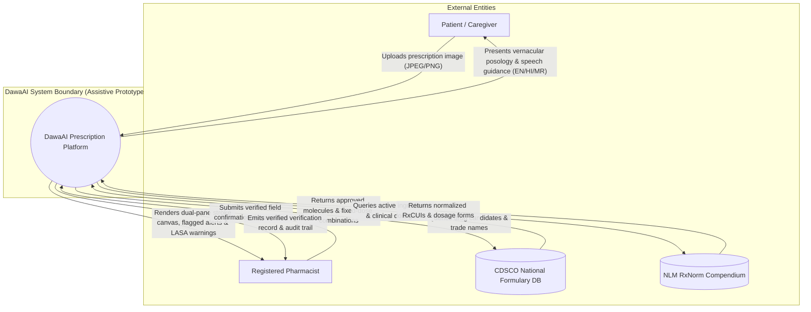
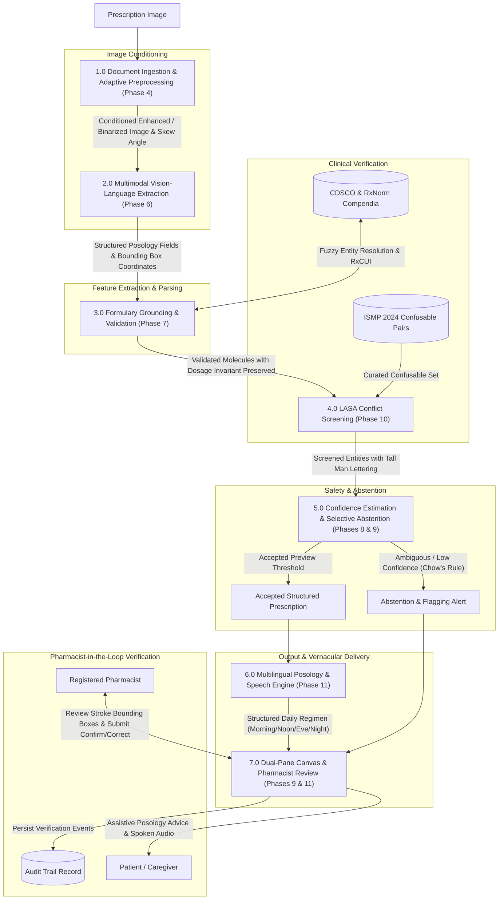
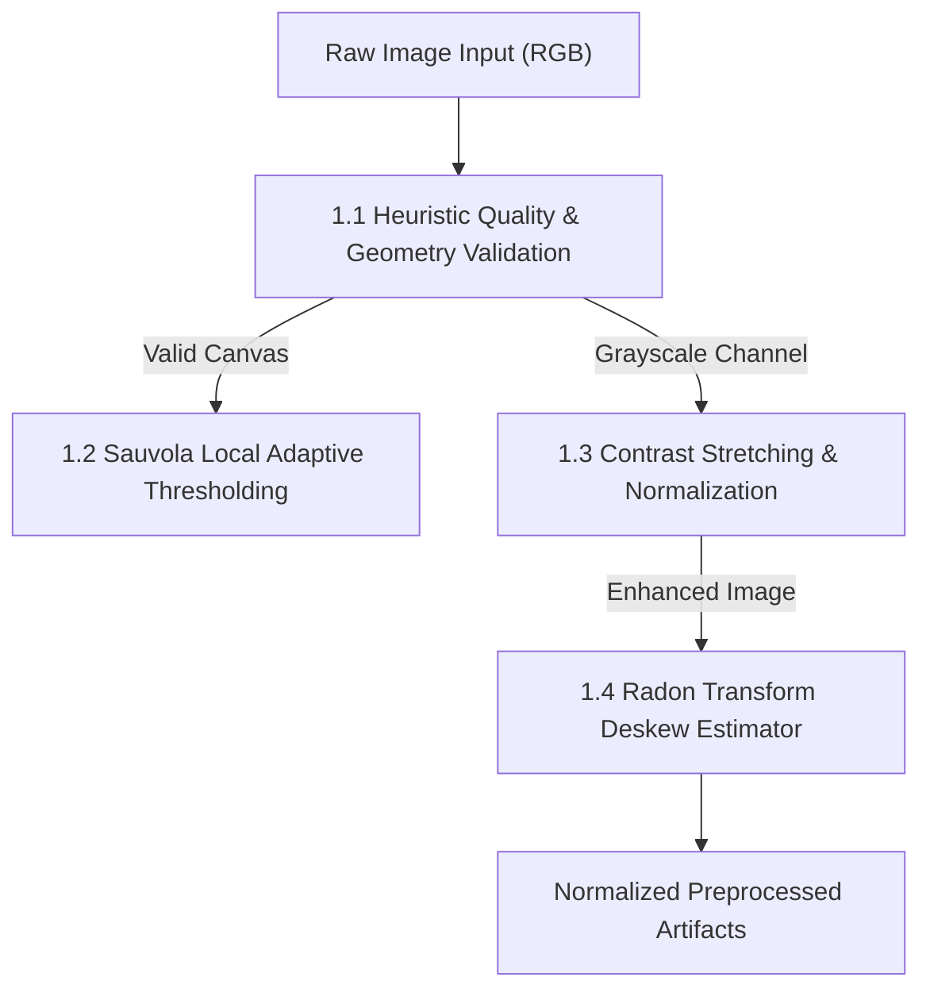
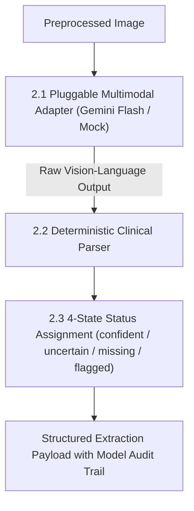
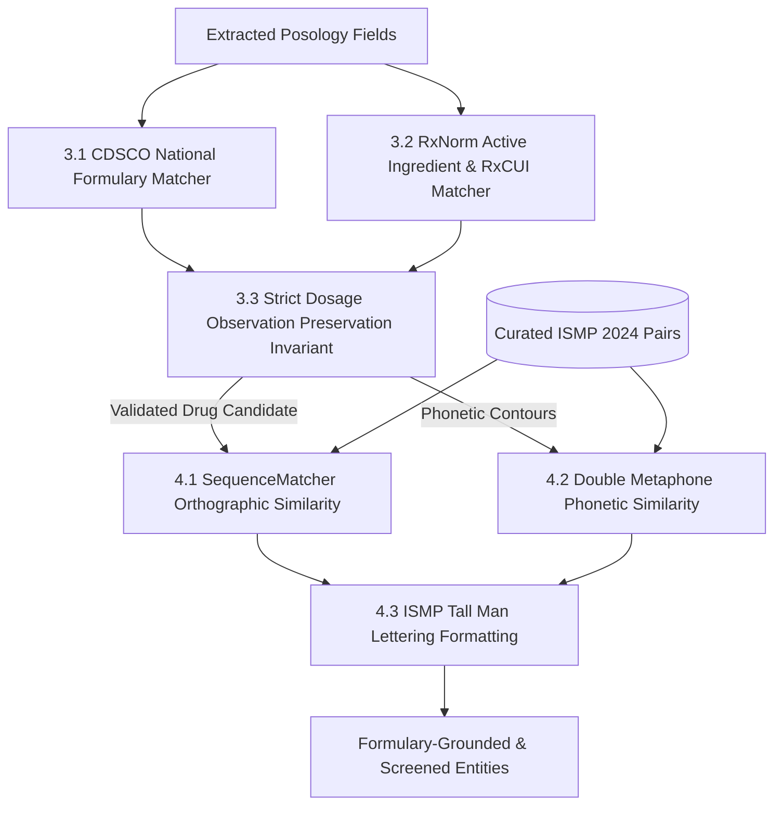
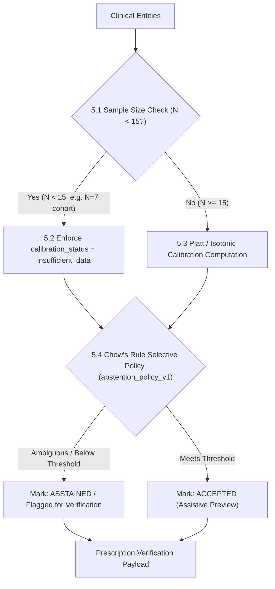
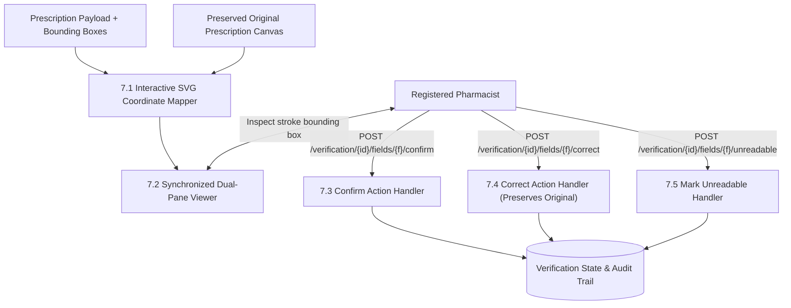

# DawaAI Architecture & Data Flow Diagrams (DFDs)
## Level 0, Level 1, and Level 2 System Decompositions

**System:** DawaAI — Explainable Multimodal AI for Handwritten Prescription Understanding  
**Document Classification:** Architectural Specification & Data Flow Engineering  
**System Classification:** Deployment-Ready Assistive Research Prototype for Academic Demonstration  
**Version:** 1.0 (Frozen Architecture)  
**Date:** March 2026

---

## 1. System Overview & Boundaries

DawaAI is architected as an assistive clinical intelligence research prototype. It enforces a strict separation of concerns between raw image conditioning, multimodal feature extraction, medical knowledge graph grounding, uncertainty gating, and human clinician verification, designed with regulatory considerations under Section 42 of the Indian Pharmacy Act (1948) in mind.

---

## 2. Level 0 DFD: System Context Diagram

The Level 0 context diagram defines the boundary between external entities (Patients, Registered Pharmacists, External Medical Compendia) and the DawaAI system core.

---

## 3. Level 1 DFD: Macro Subsystem Decomposition

The Level 1 DFD decomposes the core engine into its primary functional processes, data stores, and inter-process data flows matching the canonical phase history.

---

## 4. Level 2 DFDs: Detailed Subsystem Decompositions

### 4.1 Process 1.0: Document Preprocessing Pipeline (Phase 4)

### 4.2 Process 2.0: Multimodal Extraction (Phase 6)

### 4.3 Process 3.0 & 4.0: Formulary Grounding & LASA Screening (Phases 7 & 10)

### 4.4 Process 5.0: Confidence Estimation & Selective Abstention (Phases 8 & 9)

### 4.5 Process 7.0: Dual-Pane Grounding & Human Verification (Phase 9)

---

## 5. Prototype Storage, Security & Regulatory Boundaries

1. **Storage & Access Prototype Constraints:** Original prescription images are preserved and referenced by the application. Prototype storage and access-control limitations are documented; production-grade private cloud storage and institutional RBAC are not implemented.
2. **Statutory Non-Dispensing Boundary:** In alignment with Section 42 of the Indian Pharmacy Act (1948), the system operates strictly as an assistive research prototype. It does not autonomously dispense medication or serve as a clinical diagnostic authority.
3. **Audit Trail Logging:** Human verification actions (`confirm`, `correct`, `unreadable`) are recorded in an audit trail ledger alongside timestamps and field-level modification details.
